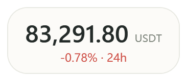

# 比特一瞥 · BitGlance

一个轻量的 Windows 桌面行情小工具，让 BTC、ETH、SOL 的 USDT 永续价格停留在桌面一角。

**Windows 10 / 11 · .NET Framework 4.8 · C# / WPF · AGPL-3.0-only**




## 功能

- **BTC / ETH / SOL**：Bitget USDT 永续合约最新成交价，可随时切换。
- **迷你悬浮窗**：始终置顶，拖动移动，双击展开。价格数字始终清晰，可隐藏单位与 24 小时涨跌幅。
- **背景不透明度 0%–100%**：独立于文字。0% 保留约 0.39% 的近乎不可见点击层，防止点击数字空隙时穿透。
- **折线 / K 线**：24H / 7D 折线；1m / 5m / 15m / 1h K 线、成交量、缩放、平移及悬停详情。
- **明暗主题与托盘**：主窗口可置顶，主窗口和迷你窗分别记住位置。
- **无账号、无 API 密钥**：只读取公开行情，设置保存在本机。

## 下载与运行

在本仓库的 **Releases** 中下载 `BitGlance-v1.2.2-Windows.zip`，解压后双击 `BitGlance.exe`。

需要 Windows 10 / 11 和 .NET Framework 4.8。应用无需安装，也不需要 Node、Rust 或 Python。发布包包含对应源码和许可证文件。

| 操作 | 方法 |
| --- | --- |
| 进入迷你窗 | 双击主窗口的大价格，或按 `Ctrl+M` |
| 展开主窗口 | 双击迷你窗，或在迷你窗按 `Esc` |
| 移动迷你窗 | 按住数字或数字周围区域拖动 |
| 切换币种 | 主窗口顶部、设置，或迷你窗右键菜单 |
| 缩放 / 查看历史 | K 线区域滚轮缩放、按住左键拖动 |
| 回到最新 K 线 | 点击“最新 →” |
| 立即刷新 | `F5` 或刷新按钮 |
| 隐藏 / 恢复 | 点“—”隐藏到托盘，双击托盘恢复 |

更多操作见 [使用说明](使用说明.md)。

## 行情与本机数据

行情来自 **Bitget `USDT-FUTURES`**，价格取 `lastPr`，K 线取 `MARKET` 类型。它显示的是永续合约最新成交价。行情按设置的间隔轮询，未收盘 K 线会继续变化。

偏好文件位于 `%LOCALAPPDATA%\BitGlance\settings.json`。应用没有交易、遥测、自动更新或开机自启功能。断线时保留最后成功的价格并显示提示；不同交易所价格可能有差异。

## 从源码构建

在 Windows PowerShell 中进入仓库目录，运行：

```powershell
powershell -NoProfile -ExecutionPolicy Bypass -File .\source\build.ps1
```

输出位于 `artifacts/build/`。构建使用 .NET Framework 自带的 `csc.exe`，无需 Visual Studio、NuGet 或联网恢复依赖。

一键构建、运行逻辑检查并生成完整发布包：

```powershell
powershell -NoProfile -ExecutionPolicy Bypass -File .\source\package.ps1
```

输出位于 `artifacts/release/`，包括 ZIP 和 SHA-256 校验文件。交互测试需要可交互的 Windows 桌面，详见 [开发与验证](CONTRIBUTING.md)。

GitHub Actions 会在推送、Pull Request 和手动运行时编译、检查并保存构建产物。它不会自动创建 Release。云端工作流需要上传仓库后首次运行验证。

## 项目结构

```text
.github/           自动构建工作流、Issue 与 PR 模板
docs/              预览图、GitHub 发布指引、Release 文案
legal/             保留的 PayDance 法律文件
source/            C# / WPF 源码、资源、构建和测试脚本
LICENSE            AGPL-3.0-only 正文
THIRD_PARTY_NOTICES.md  实际引用来源与修改说明
```

生成的 EXE、ZIP、测试文件和个人设置由 `.gitignore` 排除，成品下载包放在 Releases。

## 来源与许可

BitGlance 参考 [PayDance](https://github.com/MrBaoboer/PayDance) 的桌面交互，并将其窗口位置校验与屏幕内恢复逻辑移植为 C#。本项目是独立的修改与移植版本，**非 PayDance 官方产品**。

> Based on PayDance. Copyright (C) 2026 Mr.Baoboer.
> Licensed under the GNU Affero General Public License v3.0 only.

代码使用 [AGPL-3.0-only](LICENSE)，保留 [上游附加条款](legal/ADDITIONAL_TERMS.md)。图标和产品预览图来自 BitGlance，没有沿用 PayDance 官方品牌素材。来源、参考提交和修改范围见 [第三方声明](THIRD_PARTY_NOTICES.md)。

[更新记录](CHANGELOG.md) · [验证记录](验证记录.md) · [GitHub 发布指引](docs/PUBLISHING.md)
